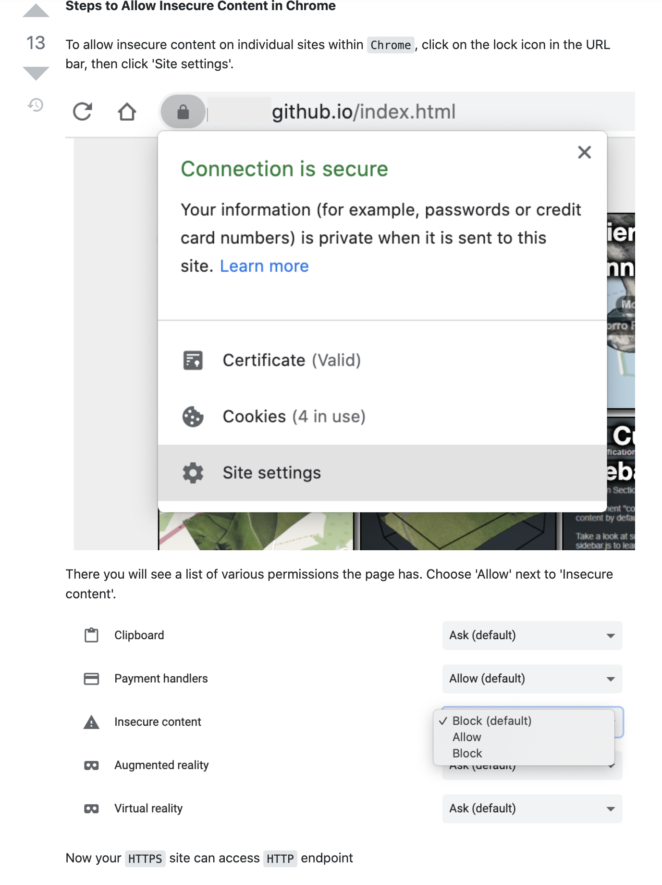

# StarNavi test task

## You can use app by this link:
[DEMO LINK](https://krulykovskyi.github.io/StarNavi-test-task/)

## Attention!
If page with demo doesn't work try to solve the problem following this steps:

[TASK SOURCE](https://starnavi-frontend-test-task-v3.netlify.app/)

## Instaled dev packages:
- react: UI library for creating modular components
- react-dom: enables us to render the React within the browser DOM
- webpack: bundler that converts your source code into production-ready output
- webpack-cli: allows webpack to work with CLI commands
- webpack-dev-server: transforms our source code and serves it on a web server as we develop it continuously. This helps use see the output of your code in the browser.
- html-webpack-plugin: an extension to webpack that adds the basic index html file
- @babel/core: a JavaScript transpiler to converts modern JavaScript into a production-ready version that's compatible with all browsers.
- babel-loader: connects Babel to webpack's build process
- @babel/preset-env: group of commonly used Babel plugins bundled into a preset that converts modern JavaScript features into widely compatible syntax
- @babel/preset-react: React-specific Babel plugins that convert JSX syntax into plain old JavaScript that browsers can understand

### To run this app on your:
  1. fork this repo
  2. clone it using `git clone (link/to/forked/repo)`
  3. install the dependencies using `npm i`
  4. start server with `npm start`
